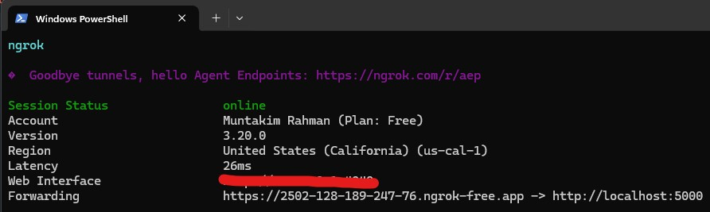

# Robot Driver App

This **Flask** application is used to send movement commands to WALL-E. This is run and hosted on a local server. A secure public URL
is temporarily created with **ngrok**. Traffic is forwarded to the local server without the need for deployment.

## Host Application

<b>Run the following commands:</b>
<ul>
    <li>Run `python app.py`</li>
    <li>Run `ngrok http http://localhost:5000`</li>
</ul>

  

<i>The app can be accessed via the forwarding URL.</i>

# Desktop App

This **Tkinter** application is used to send movement commands to WALL-E and update PID parameters for balancing.
