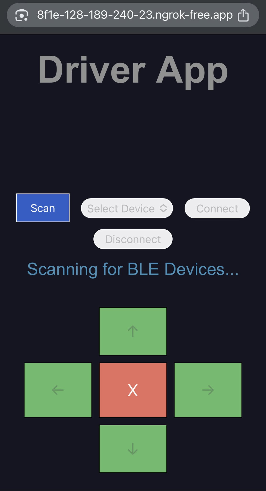
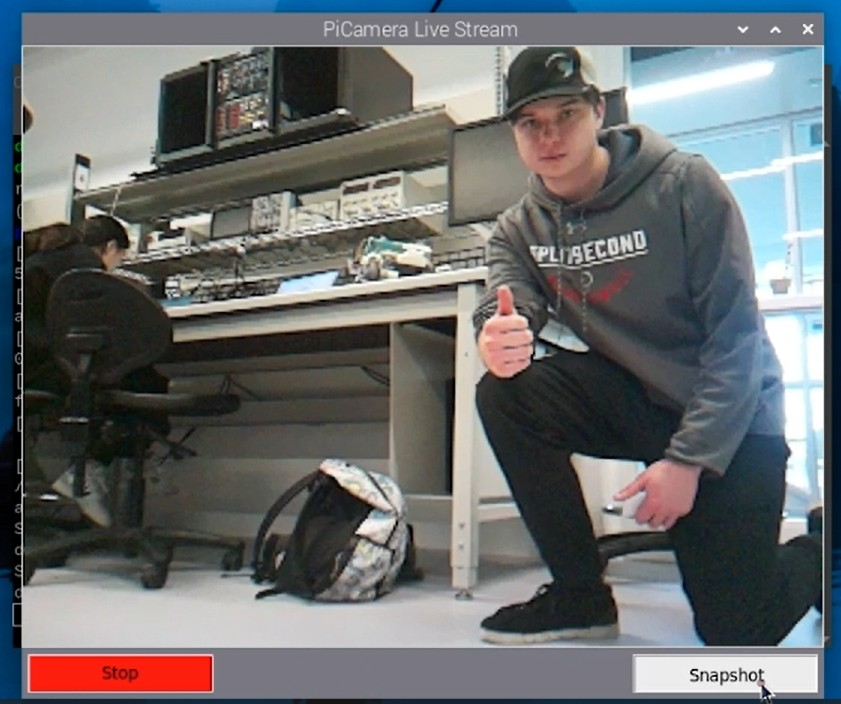

# WALL-E (Self Balancing Robot)

## Contents

* [Overview](#overview)
  * [Features](#features)
  * [Components](#components)
* [System Design](#system-design)
  * [Functional Diagram](#functional-diagram)
  * [Architecture Diagram](#architecture-diagram)
* [Robot Firmware](#robot-firmware)
  * [Arduino](#arduino)
  * [STM32](#stm32)
* [User Software](#user-software)
  * [Driver App](#driver-app)
  * [Dashboard App](#dashboard-app)
* [Demonstration](#demonstration)
* [Credit](#credit)

---

## Overview

We designed **WALL-E**, an autonomously balancing two-wheel robot driven wirelessly via bluetooth.

### Features

WALL-E prioritizes safe navigation and secure access.

- Detects the nearby environment (i.e.obstacles, color recognition)
- Prevents unauthorized control with **RFID** authentication and BLE pairing code.
- Generates live camera feed and uploads to **AWS S3** cloud storage.

### Components

- **Microcontrollers**:
  - Arduino Nano 33 BLE Sense Rev2 (Balancing & BLE)
  - STM32L051K8T6 (Environmental Sensors, Auth)
  - Raspberry Pi Zero 2 W (Camera Feed)

- **Sensors and Modules**:
  - BMM150 IMU
  - HC-SR04 Ultrasonic Distance Sensor
  - TCS34725 Color Sensor
  - RC522 RFID Module
  - CEM-1302 Buzzer
  - Freenove 5MP Camera

- **Actuation**:
  - DRV8833 Motor Drivers
  - Pololu 37D DC Motors

---

## System Design

### Functional Diagram

  

### Architecture Diagram

  

---

## Robot Firmware

### Arduino

- Autonomously balances robot with closed-loop control system (i.e. PID controller).
- Uses complementary filter to measure angular input from accelerometer and gyroscope sensors.
- Drives motors by generating PWM (slow decay) output to DRV8833 chip.
- Uses statemachine to prioritize balancing / movement functionality.
    - Injects noise (i.e. angular offset, PWM signals) to induce movement along axis / turning.

  <i>
    Source Code in <a href="/Arduino_Firmware">Arduino_Firmware</a> directory.
  </i>

### STM32

- Handles auxiliary features to reduce computational load on Arduino.
    - **Distance Sensing**: Toggles GPIO signal-low when object detected within 30cm.
    - **Color Detection**: Toggles GPIO signal-low when red is detected. WALL-E avoids red-lights at all costs.
    - **RFID Authentication**: Verifies UID and signals Arduino on success.
    - **Buzzer**: Alerts user on successful auth, errors, or warnings via PWM tone generation.

  <i>
    Source Code in <a href="/STM32_Firmware">STM32_Firmware</a> directory.
  </i>

## User Software

### Robot Driver App

- **Flask** web application hosted via **ngrok** for mobile access
- Uses **GET**/**POST** requests to update server with **UI** updates and perform bluetooth operations.
- Handles **BLE** pairing authentication in backend (i.e. without affecting user experience).

    

  <i>
    Source Code in <a href="/Driver_App">Driver_App</a> directory.
  </i>

### Dashboard App

- **Python** application with live camera stream on **Tkinter GUI**.
    - Camera runs at ~20 FPS with reduced resolution for performance on Pi Zero 2 W.
- Snapshot and recording functionality with automatic upload to **AWS S3** bucket.

    

  <i>
    Source Code in <a href="/Dashboard_App">Dashboard_App</a> directory.
  </i>

---

## Demonstration

Watch our final robot demonstration here:
📽️ [YouTube Demo](https://youtu.be/UMmxqQl_EAc?si=lTu5z8PBC82dAWoi)

## Report

Read our final project report here:
📝 [Project Report](/Report/ELEC391_B17_ProjectReport.pdf)

## Credit

This was completed as part of the **ELEC 391 - Design Studio** project course in **The University of British Columbia Electrical and Computer Engineering** undergraduate program.

**Team B-17**
- Muntakim Rahman
- Tomaz Zlindra
- Xianyao Li

Special thanks to **Dr. Joseph Yan** for tremendous support and guidance.
