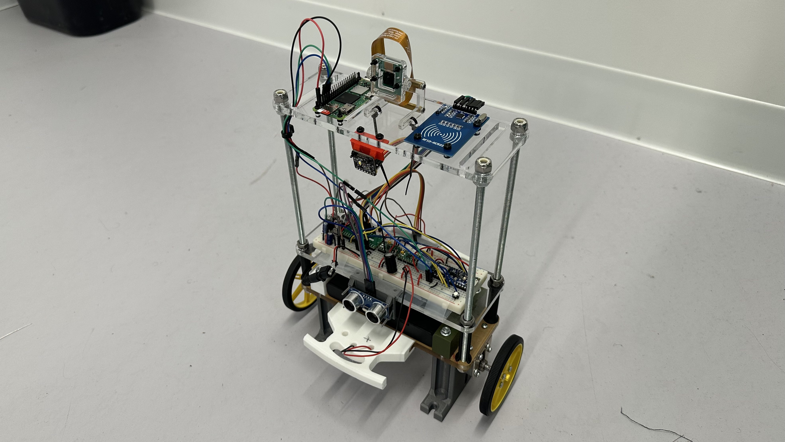
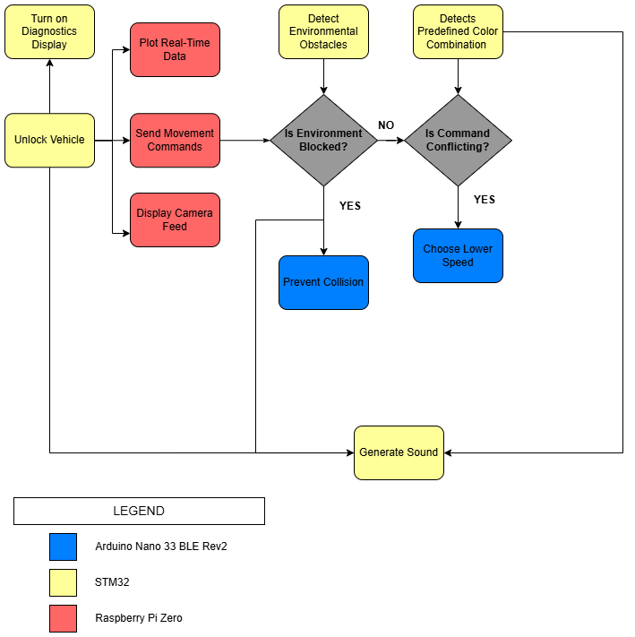
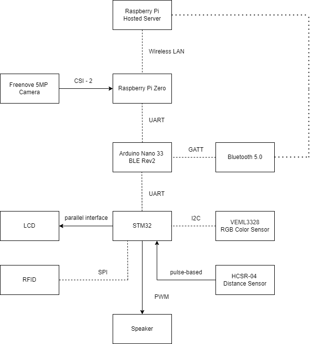

# Self Balancing Robot (WALL-E)

## Contents

* [Overview](#Overview)
    * [Components](#Components)
* [Project Proposal](#Project-Proposal)
    * [Functional Diagram](#Functional-Diagram)
    * [Architecture Diagram](#Architecture-Diagram)
* [Robot Firmware](#Robot-Firmware)
    * [Arduino](#Arduino)
    * [STM 32](#STM-32)
* [User Software](#User-Software)
    * [Driver App](#Driver-App)
    * [Dashboard App](#Dashboard-App)
* [Demonstration](#Demonstration)
* [Credit](#Credit)

## Overview

We designed an autonomously balancing two-wheel robot, with wireless movement control. This was also designed with access security and environmental detection features, with camera footage.

    

### Components

This project was developed with two **DC** motors and **DRV8833 H-Bridge** motor drivers, **Arduino Nano 33 BLE Rev2** and **STM 32** microcontrollers, and a **Raspberry Pi Zero 2 W** on-board computer.

<!-- ToDo : Describe Sensors Used -->

## Project Proposal

For the initial documentation of project requirements, we designed the following functionality and system architecture.

### Functional Diagram

    

### Architecture Diagram

    

<!-- ToDo : Describe General Functionality -->

## Robot Firmware

### Arduino

### STM 32

<!-- ToDo : Describe General Use, Implementation -->

## User Software

### Driver App

### Dashboard App

## Demonstration

We have uploaded our Final Demo on <a href="https://youtu.be/UMmxqQl_EAc?si=lTu5z8PBC82dAWoi" target="_blank">Youtube</a>.

## Credit

This was completed as part of the <b>ELEC 391 - Design Studio</b> project course in the <b>The University of British Columbia Electrical and Computer Engineering</b> undergraduate program. We received tremendous support and guidance from Dr. Joseph Yan.
