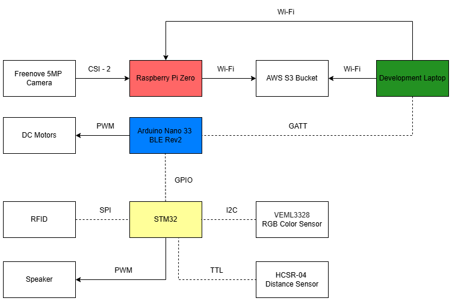

# Self Balancing Robot (WALL-E)

## Contents

* [Overview](#overview)
  * [Components](#components)
* [System Design](#system-design)
  * [Functional Diagram](#functional-diagram)
  * [Architecture Diagram](#architecture-diagram)
* [Robot Firmware](#robot-firmware)
  * [Arduino](#arduino)
  * [STM32](#stm32)
* [User Software](#user-software)
  * [Driver App](#driver-app)
  * [Dashboard App](#dashboard-app)
* [Demonstration](#demonstration)
* [Credit](#credit)

---

## Overview

We designed an autonomously balancing two-wheel robot with wireless BLE control. Our robot prioritizes safety and security, featuring environmental detection (obstacles, color recognition) and RFID authentication, in addition to a live camera feed.

  

### Components

- **Microcontrollers**:
  - Arduino Nano 33 BLE Sense Rev2 (Balancing & BLE)
  - STM32L051K8T6 (Environmental Sensors, Auth)
  - Raspberry Pi Zero 2 W (Camera Feed, AWS Upload)

- **Sensors and Modules**:
  - IMU (BMI270/BMM150)
  - Ultrasonic Distance Sensor (HC-SR04)
  - Color Sensor (TCS34725)
  - RFID Module (RC522)
  - Buzzer (CEM-1302)
  - 5MP Camera (Freenove FNK0056)

- **Actuation**:
  - DRV8833 Motor Drivers
  - DC Motors (Pololu 37D)

- **Power**:
  - 8×1.2V Rechargeable NiMH Battery Pack

---

## System Design

### Functional Diagram

  

### Architecture Diagram

  

---

## Robot Firmware

### [Arduino](Arduino_Firmware)

- Maintains balance using PID controller tuned via BLE.
- Sensor fusion using a complementary filter combining accelerometer and gyroscope data.
- PID loop runs in the main program loop for maximum timing control.
- Motor control with PWM slow decay via DRV8833.
- Prioritizes balance over movement; directional movement is achieved by injecting temporary angle offsets.

### [STM32](STM32_Firmware)

- Handles auxiliary features to reduce load on Arduino.
- **Distance Sensing**: Triggers GPIO signal to Arduino on proximity.
- **Color Detection**: Triggers alert when red is detected.
- **RFID Authentication**: Verifies UID and signals Arduino on success.
- **Buzzer**: Alerts on successful scans, errors, or warnings via PWM tone generation.

---

## User Software

### [Driver App](Driver_App)

- Flask-based BLE controller hosted via **ngrok** for mobile access.
- Provides UI buttons for movement: FORWARD, BACKWARD, LEFT, RIGHT.
- Handles pairing authentication invisibly to end user.

### [Dashboard App](Dashboard_App)

- Python GUI with live camera stream (Tkinter).
- Snapshot and recording functionality with automatic upload to AWS S3.
- Camera runs at ~20 FPS with reduced resolution for performance on Pi Zero 2 W.

---

## Demonstration

Watch our final robot demonstration here:
📽️ [YouTube Demo](https://youtu.be/UMmxqQl_EAc?si=lTu5z8PBC82dAWoi)

---

## Credit

This project was developed for **ELEC 391 - Design Studio** at **The University of British Columbia**.

**Team B-17**
- Muntakim Rahman
- Tomaz Zlindra
- Xianyao Li

Special thanks to **Dr. Joseph Yan** for tremendous course support.
